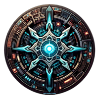

    <picture>
      
    </picture>

<b>Unofficial mainframe for Android Netrunner rules</b>
 
https://netrunnercodex.github.io
  
    <picture>

    </picture>

## >_SYSTEM_DATA_UPLOAD

**$IMPORT_DATA**: ACTIVE. 
**$SERVER_FUNCTION**: OPEN-SOURCE ANDROID NETRUNNER CARD GAME RULES LIBRARY. 
**$CONTENT_SUMMARY**: SOURCE MATERIAL NODES BY MODULE. CORE DATA ONLY. 
**$STATUS**: IMMERSIVE EXPLORATION READY.

 

## >_DOMAIN

**$SSG**: https://jekyllrb.com 
**$INTERFACE**: https://github.com/just-the-docs/just-the-docs 
**$FUNCTION_KEY**: https://custom-icon-badges.demolab.com

 

## >_RAW_COGNITIVE_FEED

**$Android_Netrunner**: [Android Netrunner (FFG)](https://www.fantasyflightgames.com/en/products/android-netrunner-the-card-game) OUT OF PRINT (2018)

 

### >_DATA_DIRECTIVE_7A-14
The Android Universe and Netrunner content featured on this site, including all imagery and intellectual property, is the copyright of their respective rights holders, including Fantasy Flight Games, and is provided solely for informational and educational purposes. The open-source Netrunner Codex project is an unofficial, non-profit and non-commercial fansite. This project is not affiliated with, endorsed by, or sponsored by Fantasy Flight Games or any other rights holders. All trademarks, logos, imagery, and related graphics remain the exclusive property of their respective owners.

  

Netrunner is a TM of R. Talsorian Games, Inc. Android is a TM & © Fantasy Flight Games. All rights reserved. Netrunner is licensed by Wizards of the Coast LLC. © Wizards.

