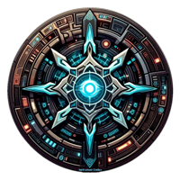

    <picture>
      
    </picture>

<b>Unofficial rules mainframe for Android Netrunner </b>
 
https://netrunnercodex.github.io
  
    <picture>

    </picture>

## >_01_SYSTEM_DATA_UPLOAD

**$IMPORT_DATA**: ACTIVE. 
**$SERVER_FUNCTION**: ANDROID NETRUNNER CARD GAME OPEN-SOURCE RULES ARCHIVE. 
**$CONTENT_SUMMARY**: SOURCE MATERIAL NODES BY MODULE. CORE DATA ONLY. 
**$STATUS**: IMMERSIVE EXPLORATION READY.
**$CHANGELOG_NODE**: [/wiki/changelog](https://github.com/NetrunnerCodex/NetrunnerCodex.github.io/wiki)

 

## >_02_DOMAIN_CONTROLLER

**$SSG**: https://jekyllrb.com 
**$INTERFACE**: https://github.com/just-the-docs/just-the-docs 
**$FUNCTION_KEY**: https://custom-icon-badges.demolab.com

 

## >_03_RAW_COGNITIVE_FEED

**$Android_Netrunner**: [Android Netrunner (FFG)](https://www.fantasyflightgames.com/en/products/android-netrunner-the-card-game) OUT OF PRINT (2018)

 

## >_04_DATA_DIRECTIVE_7A-14
The Android Universe and Netrunner content featured on this site, including all imagery and intellectual property, is the copyright of their respective rights holders, including Fantasy Flight Games, and is provided solely for informational and educational purposes. The open-source Netrunner Codex project is an unofficial, non-profit and non-commercial fansite. This project is not affiliated with, endorsed by, or sponsored by Fantasy Flight Games or any other rights holders. All trademarks, logos, imagery, and related graphics remain the exclusive property of their respective owners.

  

© 2026 [Dial‑Up Mod Lab](https://linktr.ee/DialUpModLab). All original content is released as open source unless otherwise stated. This is a fanmade, unofficial and non‑commercial project shared for personal and educational use only; not for resale or commercial distribution.
  
The Netrunner Codex project is not affiliated with, endorsed by, or sponsored by Fantasy Flight Games, Wizards of the Coast, R. Talsorian Games, or any other rights holders.
  
Netrunner, Android and all related trademarks, artwork, card images and intellectual property remain the exclusive property of their respective owners. Such materials are used here for informational and educational purposes only. Their inclusion does not imply any ownership or endorsement.
  
Netrunner is a trademark of R. Talsorian Games, Inc.; © Wizards of the Coast LLC. Android is a trademark and copyright of Fantasy Flight Games.

